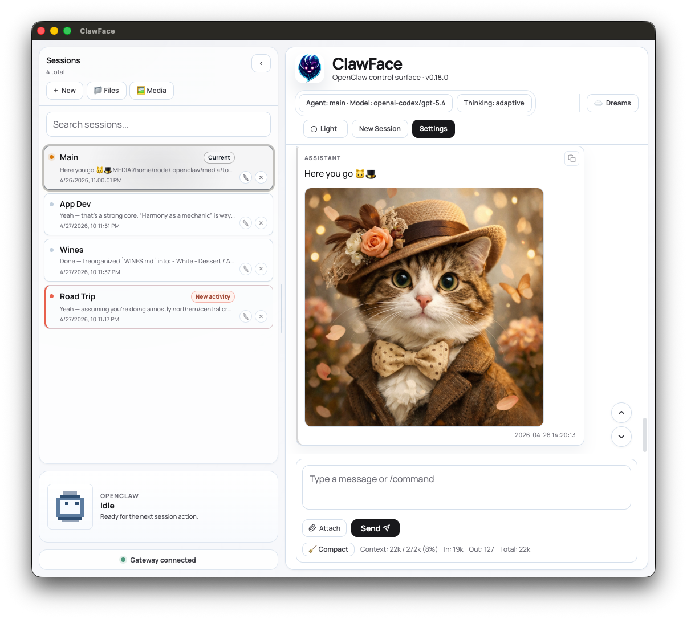

# ClawFace

ClawFace is a desktop-first OpenClaw client for people who want sessions, tools,
files, media, and memory visibility to feel like one coherent workstation.

It is built for users who already run OpenClaw locally, in Docker, or on
self-hosted infrastructure, and want a polished day-to-day desktop interface on
top of the OpenClaw gateway.



## Why ClawFace

OpenClaw is powerful, but its capabilities can be spread across chat, backend
surfaces, files, media folders, tools, and long-running background work.
ClawFace brings the parts you use most often into a single desktop app:

- a conversational center for active work
- first-class sessions instead of throwaway chat tabs
- visible tool activity and connection state
- desktop-native file, image, and media workflows
- OpenClaw memory surfaces such as the Dream Diary
- settings for local, Docker, and remote OpenClaw setups

ClawFace is OpenClaw-native. It is not trying to be a generic multi-provider
chat shell or a replacement for OpenClaw's backend admin/configuration UI.

## Highlights

- **Session-centered chat** with streaming replies, model and thinking controls,
  session search, session rename support, deletion, activity markers, and a
  dedicated new-session flow.
- **Gateway connection feedback** with a visible status indicator and a
  Settings test button that reports success or gives a focused error summary.
- **Animated pixel avatar** with selectable sprite styles and state-specific
  animations for idle, thinking, streaming, tool use, success, warnings,
  approvals, and disconnected states.
- **Resizable workstation layout** with draggable vertical seams between the
  Sessions, Chat, and Dreams/memory panes. Widths persist between launches.
- **Files and Media surfaces** for browsing OpenClaw-adjacent workspace files
  and generated media without leaving the app.
- **Image and attachment workflows** with drag/drop, paste-image handling,
  staged attachments, generated-image rendering, image previews, and native
  right-click save behavior in the preview window.
- **Dream Diary reader** that presents OpenClaw dream output as a focused
  timeline, filters out non-diary background artifacts, and keeps dream-writing
  sessions out of the main user session list.
- **Desktop-oriented customization** including light/dark mode, typography,
  layout sizing, settings schemes, app shortcuts, reply-complete sounds, tool
  visibility, and Docker path-prefix mappings.

## Quick Start

ClawFace connects to an OpenClaw gateway you already have running. The default
gateway URL is:

```text
ws://127.0.0.1:18789
```

1. Start OpenClaw.
2. Launch ClawFace.
3. Open **Settings -> Gateway**.
4. Set the WebSocket URL, token, password, and optional file server URL for your
   OpenClaw setup.
5. Click **Test** next to the WebSocket URL to confirm the gateway connection.

For setup by deployment type, see [ClawFace Quick Start](./docs/QUICK-START.md):

- OpenClaw running directly on your host system
- OpenClaw running in Docker on your host system
- OpenClaw running remotely on another machine or server

## Install

### Download a Release

When a tagged release is available, download the artifact for your platform from
the project's [GitHub Releases](https://github.com/oberones/ClawFace/releases)
page:

- macOS arm64: `.dmg` or `.zip`
- Windows x64: `.exe` installer or `.zip`
- Linux x64: `.AppImage`, `.deb`, or `.rpm`

Release binaries are currently unsigned, so your operating system may ask for an
extra confirmation step the first time you launch the app.

### Run From Source

Source builds require:

- Node.js `22.22.0`
- npm `10.9.4`

Install dependencies and start the desktop app:

```bash
npm ci
npm run desktop:dev
```

Create a packaged build for your current machine:

```bash
npm run desktop:pack
```

Build distributable platform artifacts:

```bash
npm run desktop:dist:mac
npm run desktop:dist:mac:x64
npm run desktop:dist:win
npm run desktop:dist:linux
```

Packaged artifacts are written to `desktop-dist/`.

## Media and Workspace Access

ClawFace can render generated images and local media when it can resolve the
paths OpenClaw reports. The right configuration depends on where OpenClaw runs.

For a normal host install, OpenClaw-generated media is usually available at:

```text
~/.openclaw/media
```

Workspace files are usually available at:

```text
~/.openclaw/workspace
```

For the common local Docker layout, add these mappings in
**Settings -> Path Prefix Mappings**:

```text
/home/node/.openclaw/media => ~/.openclaw/media
/home/node/.openclaw/workspace => ~/.openclaw/workspace
```

These mappings translate paths emitted by OpenClaw inside the container into
paths ClawFace can read on the host. Remote OpenClaw installs need a reachable
file/media server, a gateway-served artifact path, or a mounted network
filesystem; path mappings alone do not make remote files available locally.

### File Server URL

Leave **File Server URL** blank for normal local use. When set, ClawFace uses it
as the base URL for the Files surface and sends file requests to:

```text
<File Server URL>/__claw/fs
```

This is only needed for remote setups that expose a compatible file API. It does
not replace the OpenClaw gateway WebSocket URL, and it does not make remote
files available unless that server can actually read and serve the target
workspace or media files.

## Current Boundaries

- ClawFace expects an existing OpenClaw gateway; it does not install or manage
  the OpenClaw backend for you.
- ClawFace focuses on the working desktop experience, not backend
  administration or configuration replacement.
- The Dreams surface reads OpenClaw's currently exposed Dream Diary snapshot
  rather than a raw backend event log.
- Some local settings and compatibility keys still use the legacy `clawui` name
  so existing installs keep working.

## For Contributors

Start here if you are developing ClawFace:

- [AGENTS.md](./AGENTS.md) for repo bootstrap guidance and working conventions
- [docs/PRODUCT-BRIEF.md](./docs/PRODUCT-BRIEF.md) for product framing
- [docs/ARCHITECTURE.md](./docs/ARCHITECTURE.md) for architecture notes
- [docs/DEVELOPMENT_CONSTRAINTS.md](./docs/DEVELOPMENT_CONSTRAINTS.md) for
  runtime and validation expectations

Common commands:

```bash
make help
make install
make dev
make build
make typecheck
make test-unit
make verify
```

Use `make typecheck` and `make build` as the normal completion gate. Also run
`make test-unit` when touching media rendering, path-prefix mapping, Dream Diary
parsing, session normalization, gateway connection handling, or other helper
logic covered by focused regression tests.

## License

[MIT](LICENSE)
