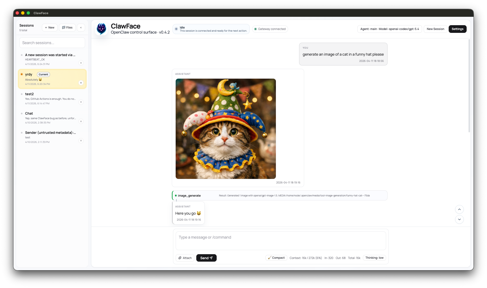

# ClawFace

Desktop-first OpenClaw client for people who want sessions, tools, files, media, and memory visibility to feel like part of one real desktop app instead of scattered backend surfaces.



> Compatibility note: some local settings and compatibility keys still use the legacy `clawui` name so existing installs keep working.

## What ClawFace Is

ClawFace is the desktop frontend for OpenClaw users who already run OpenClaw locally or on self-hosted infrastructure and want a better day-to-day interface.

- OpenClaw-native rather than a generic multi-provider chat shell
- Desktop-first rather than a web-first collaboration app
- Conversation-centered, with first-class sessions, tools, files, media, and memory visibility
- Focused on using OpenClaw, not replacing OpenClaw's backend admin/config surfaces

## What You Can Do Today

- Use **session-centered desktop chat** with streaming replies, connection feedback, model/thinking controls, and session activity visibility
- Work with **desktop attachments** through drag/drop, paste-image handling, staged attachments, local image rendering, and image lightbox support
- Follow **tool activity** in the conversation flow instead of digging through raw trace output
- Browse **Files** and **Media** inside dedicated app surfaces
- Read the **Dream Diary** in a focused timeline reader that splits visible diary timestamps into individual entries, including repeated same-hour entries
- Keep OpenClaw dream-writing background sessions out of the main session list while still reading their human-facing diary output
- Use **desktop-oriented settings** such as path-prefix mappings for shared-volume/container installs

## Quick Start

ClawFace currently works best as a desktop app pointed at an OpenClaw gateway you already have running.

```bash
npm ci
npm run desktop:dev
```

Use the pinned runtime for source builds:

- Node.js `22.22.0`
- npm `10.9.4`

Packaged binaries are attached to GitHub Releases when maintainers tag a commit on `main`.

## Install

### Download a Release

When a tagged release is available, download the appropriate artifact from the project's GitHub Releases page:

- macOS arm64: `.dmg` or `.zip`
- Windows x64: `.exe` installer or `.zip`
- Linux x64: `.AppImage`, `.deb`, or `.rpm`

Release binaries are currently unsigned. Your operating system may require an extra confirmation step on first launch.

### macOS

1. Install **Node.js `22.22.0`** and **npm `10.9.4`**.
2. Clone this repo.
3. Install dependencies:

```bash
npm ci
```

4. Start the desktop app in development mode:

```bash
npm run desktop:dev
```

5. If you want a packaged macOS build, create one with:

```bash
npm run desktop:dist:mac
```

That writes unsigned macOS arm64 `.dmg` and `.zip` artifacts to `desktop-dist/`.

To build macOS x64 artifacts instead, run:

```bash
npm run desktop:dist:mac:x64
```

### Windows

1. Install **Node.js `22.22.0`** and **npm `10.9.4`**.
2. Clone this repo in PowerShell or Command Prompt.
3. Install dependencies:

```bash
npm ci
```

4. Start the desktop app:

```bash
npm run desktop:dev
```

5. If you want an unpacked desktop build for your current machine, run:

```bash
npm run desktop:pack
```

6. To build distributable Windows x64 artifacts, run:

```bash
npm run desktop:dist:win
```

Notes:
- The release workflow builds Windows x64 `.exe` and `.zip` artifacts.
- Local Windows packages are unsigned.

### Linux

1. Install **Node.js `22.22.0`** and **npm `10.9.4`**.
2. Clone this repo.
3. Install dependencies:

```bash
npm ci
```

4. Start the desktop app:

```bash
npm run desktop:dev
```

5. If you want an unpacked desktop build for your current machine, run:

```bash
npm run desktop:pack
```

6. To build distributable Linux x64 artifacts, run:

```bash
npm run desktop:dist:linux
```

Notes:
- The release workflow builds Linux x64 `.AppImage`, `.deb`, and `.rpm` artifacts.
- If Electron reports missing system libraries on your distro, install the usual desktop GUI dependencies required by Electron and retry.

## Notes

### Current Boundaries

- ClawFace works on top of the OpenClaw gateway surfaces that already exist today.
- This repo does **not** make backend OpenClaw changes.
- The Dreams surface reads the currently exposed Dream Diary snapshot rather than a raw backend event log.
- Diary chronology is parsed from visible `DREAMS.md` headings and timestamps, so unusual diary structures may show limited chronology while keeping the text readable.

### Media Path Mapping

ClawFace can render OpenClaw-generated images and other local media in several deployment shapes, but the path resolution strategy depends on where OpenClaw is running.

- **OpenClaw on the host machine**: media paths usually resolve directly.
- **OpenClaw in a local container with shared volumes**: use **Settings -> Path Prefix Mappings** to map container paths to host paths.
- **OpenClaw on a remote machine**: path mappings alone are not enough unless the remote media directory is also exposed locally; use a file/media server or a gateway-served media endpoint for that setup.

The most common Docker mapping looks like:

```text
/home/node/.openclaw/media => ~/.openclaw/media
/home/node/.openclaw/workspace => ~/.openclaw/workspace
```

## For Contributors

If you are contributing to the app or onboarding quickly, start with:

- [`AGENTS.md`](./AGENTS.md) for repo bootstrap guidance and working conventions
- [`docs/DEVELOPMENT_CONSTRAINTS.md`](./docs/DEVELOPMENT_CONSTRAINTS.md) for pinned runtime details and required checks
- [`docs/ARCHITECTURE.md`](./docs/ARCHITECTURE.md) for current architecture boundaries and refactor guidance
- [`docs/PRODUCT-BRIEF.md`](./docs/PRODUCT-BRIEF.md) for product framing

### Common Development Commands

```bash
make help
make install
make dev
make build
make typecheck
make test-unit
make verify
```

`make test-unit` currently covers:

- path prefix mapping for shared-volume/container installs
- generated-image source resolution into `~/.openclaw/media`
- renderer image source selection when both pretty filenames and concrete UUID media paths are present
- Dream Diary parsing and timeline normalization, including OpenClaw timestamp formats and repeated same-hour entries
- gateway response normalization, including filtering OpenClaw dream narrative background sessions out of the user-facing session list

Practical validation guidance:

- `make test-unit` for helper-level regressions
- `make typecheck` for renderer/app safety
- `make build` for the production bundling check
- add a desktop visual pass for Dream Diary, Files, Media, and session-shell changes because they rely on adjacent pane composition and desktop interaction details

### Runtime Expectations

ClawFace is currently pinned to:

- Node.js `22.22.0`
- npm `10.9.4`

If you see `EBADENGINE` warnings on Node 20, treat that as a runtime mismatch rather than as supported dual-runtime behavior.

## License

[MIT](LICENSE)
